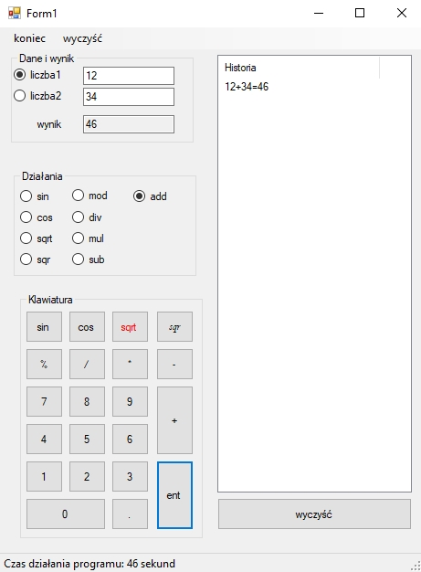

# Calc
Simple Calculator app created with C# Windows Forms

### Implemented
- methematical fuctions such as: addition, subtraction, division, multiplication, modulo, sine, cosine, sqrt, sqr.ltiplication, modulo, sine, cosine, sqrt, sqr.
- operation history
- clearing history
- clearing textboxes
- application runtime

